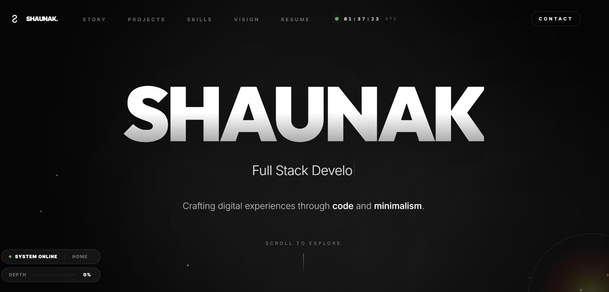

# Shaunak Sikdar — Professional Portfolio

A high-performance, minimalist portfolio built with React, Vite, and Tailwind CSS. This project features a curated "timeline" journey, interactive project showcases, and a premium resume viewing experience.



## ✨ Features

- **Smooth Experience:** Integrated with **Lenis** for buttery-smooth kinetic scrolling.
- **Micro-interactions:** Powered by **Framer Motion (motion/react)** for fluid entrances, magnetic buttons, and hover effects.
- **Narrative Timeline:** A structured journey through "The Beginning," "The Evolution," "The Present," and "The Future."
- **Live Resume Glimpse:** A dedicated resume section featuring a "Live Glimpse" PDF preview and direct download capabilities.
- **Adaptive Navigation:** A floating glassmorphism navbar with a custom mobile overlay that includes a smart scroll lock.
- **Real-time Elements:** Includes a custom Live Clock tracking IST and a Status HUD.
- **Responsive Design:** Desktop-first precision with a mobile-optimized interface.

## 🛠️ Tech Stack

- **Framework:** React 18 (Vite)
- **Styling:** Tailwind CSS
- **Animations:** motion/react (formerly Framer Motion)
- **Icons:** Lucide React
- **Scrolling:** Lenis
- **Deployment:** Cloud Run / Vercel ready

## 🚀 Getting Started

### Prerequisites

- Node.js (v18 or higher)
- npm or yarn

### Installation

1. Clone the repository:
   ```bash
   git clone https://github.com/shaunaksikdar/portfolio.git
   ```

2. Install dependencies:
   ```bash
   npm install
   ```

3. Start the development server:
   ```bash
   npm run dev
   ```

## 📂 Project Structure

- `src/components/`: Reusable UI components (Magnetic buttons, Timeline sections, etc.)
- `src/components/ResumeSection.tsx`: Handle PDF preview and downloads.
- `public/`: Static assets (Place your `resume.pdf` here).
- `src/App.tsx`: The heart of the application with main layout and navigation logic.

## 📝 Customization

To add your own resume:
1. Place your PDF in the `public/` folder.
2. Ensure it is named `resume.pdf`.
3. The "Live Glimpse" preview in `ResumeSection.tsx` will automatically pick it up.

## 📄 License

This project is open-source. Feel free to use it as a foundation for your own portfolio.

---

Built with ✨ by [Shaunak Sikdar](mailto:shaunaksikdar@gmail.com)